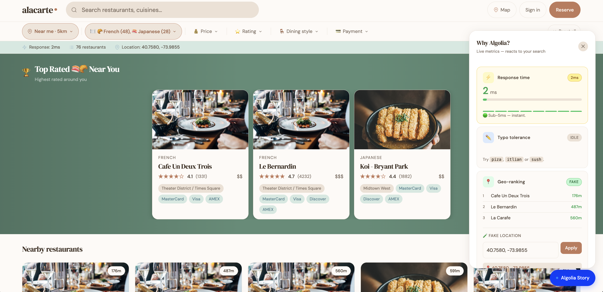

# alacarte — Restaurant Search Demo

A restaurant reservation search experience built with **Algolia JS Helper**, demonstrating real-time search, geo-ranking, faceted filtering, typo tolerance, and full analytics — without InstantSearch.js.

Built as part of the Algolia Solutions Engineer technical assignment.

**[Live demo →](https://estelleka.github.io/alacarte-search/)** *(deploy to GitHub Pages to activate)*

---



---

## Tech Stack

| Layer | Technology |
|-------|-----------|
| Frontend | Vanilla JS (no framework, no bundler) |
| Search | [Algolia JS Helper v3](https://github.com/algolia/algoliasearch-helper-js) |
| Analytics | [Algolia Insights v2](https://www.algolia.com/doc/guides/sending-events/getting-started/) |
| Maps | [Leaflet 1.9](https://leafletjs.com) + CartoDB tiles |
| Geocoding | [Nominatim / OpenStreetMap](https://nominatim.openstreetmap.org) |
| Testing | [Vitest](https://vitest.dev) (unit) + [Playwright](https://playwright.dev) (E2E) |

---

## Setup

### 1. Install dependencies

```bash
npm install
pip install algoliasearch pandas
```

### 2. Configure frontend credentials

```bash
cp .env.example .env
# Edit .env with your ALGOLIA_APP_ID and ALGOLIA_API_KEY
npm run setup   # generates config.js locally
```

### 3. Configure your Algolia index

Set your admin key (never commit this) and run the configuration script:

```bash
export ALGOLIA_APP_ID=13QP82NDZ9
export ALGOLIA_ADMIN_KEY=<your_admin_key>
export ALGOLIA_INDEX=restaurants

python scripts/configure_index.py
```

This applies searchable attributes, custom ranking, and facets to the index.

### 4. Import the data

```bash
# Preview without pushing (recommended first)
python scripts/import_to_algolia.py --dry-run

# Full import (~5000 restaurants)
python scripts/import_to_algolia.py
```

The script merges `data/restaurants_list.json` (base records) with `data/restaurants_info.csv` (food type, ratings, price range) and pushes the combined dataset to Algolia in batches of 1000.

### 5. Open the app

Open `index.html` in a browser, or serve locally:

```bash
npx serve .
```

---

## Features testing

1. **As-you-type search** — type "pizza" → instant results, term highlighted in card name
2. **Typo tolerance** — type "piza" or "sush" → Algolia corrects silently, badge appears in stats bar
3. **Faceted filtering** — filter by Cuisine > Italian, then add Price > $$ → disjunctive facets, independent counts
4. **Rating filter** — add ★4+ → numeric filter, result count drops
5. **Geo ranking** — click Location > Use my location → pins cluster near user, results re-rank by proximity
6. **Map view** — open Map → all 5000 restaurants visible (full dataset via Browse API, no 1000-hit limit)
7. **Empty state** — type "xyzxyz" → custom empty state with fallback suggestions (top-rated restaurants)
8. **Analytics** — open Events Debugger → click a card and "Reserve a table" → see events flow in real time
9. **Mobile** — resize to 375px → responsive layout, bottom-sheet modal, touch-optimised filters

---

## Algolia Features Demonstrated

| Feature | Where in code |
|---------|--------------|
| As-you-type search (debounced 200ms) | `app.js` → `search-input` listener |
| Typo tolerance | Algolia default; displayed via `results.queryAfterRemoval` |
| Highlighting | `hit._highlightResult.name.value` in `cardHTML()` |
| Disjunctive facets | `helper` config + `applyAllChipFilters()` |
| Numeric filtering (stars) | `helper.addNumericRefinement('stars_count', '>=', n)` |
| Geo-ranking (aroundLatLng) | `applyGeoFilter()` → `helper.setQueryParameter` |
| Geo-radius slider | `fbar-radius-slider` → `geoRadius * 1000` metres |
| Browse API (full dataset on map) | `loadMapCache()` → `client.initIndex().browseObjects()` |
| getRankingInfo (distance label) | `hit._rankingInfo.geoDistance` → `distanceLabel()` |
| Query Suggestions (autocomplete) | `suggestionsIndex.search()` → `showAutocomplete()` |
| Empty state + fallback search | `launchFallbackSearch()` — relaxes filters progressively |
| **Insights — view tracking** | `aa('viewedObjectIDs')` on modal open |
| **Insights — click tracking** | `aa('clickedObjectIDsAfterSearch')` with queryID + position |
| **Insights — conversion tracking** | `aa('convertedObjectIDsAfterSearch')` on "Reserve a table" |
| **Insights — filter tracking** | `aa('clickedFilters')` on cuisine, price, payment selection |


---

## Analytics & Insights

The app sends four event types to Algolia Insights, enabling the full Search → View → Convert funnel:

| Event | Method | Trigger |
|-------|--------|---------|
| `Restaurant Viewed` | `viewedObjectIDs` | Opening a restaurant modal |
| `Restaurant Clicked` | `clickedObjectIDsAfterSearch` | Clicking a result card (includes position) |
| `Reservation Clicked` | `convertedObjectIDsAfterSearch` | Clicking "Reserve a table" after a search |
| `Reservation Clicked` | `convertedObjectIDs` | Clicking "Reserve" without a prior search |
| `Filter Applied` | `clickedFilters` | Selecting any cuisine, price, payment, or dining filter |

**Verify in the Events Debugger:**
```
https://dashboard.algolia.com/apps/13QP82NDZ9/events-debugger
```

Events appear in real time. Conversion rate and CTR metrics are available under **Observe → Analytics** after 24h of data.

**Key implementation details:**
- `clickAnalytics: true` on the helper ensures `queryID` is returned with every search
- `useCookie: true` auto-generates a persistent `userToken` per visitor
- Fallback to `clickedObjectIDs` / `convertedObjectIDs` (no queryID) when the user browses without searching
- Only the **search-only API key** is used in the frontend — the admin key is never exposed

---

## Index Configuration

Managed by `scripts/configure_index.py`:

```
searchableAttributes:
  1. name
  2. food_type (unordered)
  3. neighborhood, city (unordered)
  4. dining_style (unordered)

customRanking:
  desc(stars_count), desc(reviews_count)

attributesForFaceting:
  searchable(food_type), dining_style, price_range,
  payment_options, stars_count
```

---

## Data Pipeline

```
data/restaurants_list.json   ─┐
                               ├─► scripts/import_to_algolia.py ──► Algolia index
data/restaurants_info.csv    ─┘
```

`restaurants_list.json` contains base restaurant data (name, address, geo, payment options).
`restaurants_info.csv` enriches each record with food type, star rating, price range, and dining style, joined on `objectID`.

---

## Tests

```bash
npm test              # 21 unit tests (utils.js pure functions)
npm run test:e2e      # 55 E2E tests across 9 spec files (Playwright)
npm run test:all      # both
```

---

## File Structure

```
alacarte-search/
├── data/
│   ├── restaurants_list.json    Base records (5000 restaurants)
│   └── restaurants_info.csv     Enrichment: food type, ratings, price
├── scripts/
│   ├── import_to_algolia.py     Merge JSON+CSV and push to Algolia
│   ├── configure_index.py       Apply index settings (ranking, facets)
│   └── generate-config.js       Generates config.js from .env
├── src/images/fallbacks/        Cuisine-specific fallback images (19 types)
├── tests/
│   ├── unit/utils.test.js       Unit tests for pure utility functions
│   └── e2e/*.spec.js            Playwright E2E test suites
├── .github/workflows/
│   └── deploy.yml               GitHub Pages deployment workflow
├── app.js                       Main application logic (~1500 lines)
├── utils.js                     Pure functions & constants (testable)
├── config.js                    Algolia credentials (generated by npm run setup — gitignored)
├── config.example.js            Template for config.js
├── .env.example                 Required environment variable names
├── .gitignore                   Ignores .env and config.js
├── index.html                   HTML structure + Algolia CDN scripts
├── styles.css                   Responsive styles (mobile-first)
├── customer-questions-answered.txt  Written answers to the assignment customer questions
└── package.json                 Dependencies (search-insights, vitest, playwright)
```

---

## Relevant Algolia Documentation

- [JS Helper — getting started](https://www.algolia.com/doc/api-client/methods/search/)
- [JS Helper — full API reference](https://www.algolia.com/doc/api-reference/widgets/js-helper/)
- [Sending events with Insights](https://www.algolia.com/doc/guides/sending-events/getting-started/)
- [Disjunctive faceting](https://www.algolia.com/doc/guides/managing-results/refine-results/faceting/#disjunctive-faceting)
- [Geo-search parameters](https://www.algolia.com/doc/guides/managing-results/refine-results/geolocation/)
- [Custom ranking](https://www.algolia.com/doc/guides/managing-results/must-do/custom-ranking/)
- [Query Suggestions](https://www.algolia.com/doc/guides/building-search-ui/ui-and-ux-patterns/query-suggestions/js/)
- [Browse API (no hit limit)](https://www.algolia.com/doc/api-reference/api-methods/browse/)
